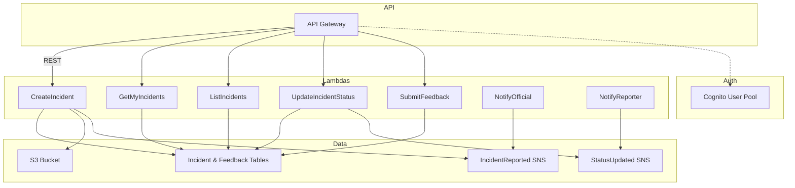

# Monitoring & Reporting Platform Backend (AWS SAM)

This project is an AWS Serverless backend for a monitoring and reporting platform, built with AWS SAM (Serverless Application Model). It provides RESTful APIs for incident reporting, feedback, and notifications, using AWS Lambda, API Gateway, DynamoDB, S3, SNS, and Cognito.

---

## Table of Contents

- [Features](#features)
- [Architecture](#architecture)
- [Folder Structure](#folder-structure)
- [Prerequisites](#prerequisites)
- [Setup](#setup)
- [Configuration](#configuration)
- [Deployment](#deployment)
- [Local Development & Testing](#local-development--testing)
- [CI/CD](#cicd)
- [Security & IAM](#security--iam)
- [Extending the Project](#extending-the-project)
- [AWS Resource Setup](#aws-resource-setup)

---

## Features

- User authentication with AWS Cognito (citizen, cityAuth, admin roles)
- Incident reporting and management (CRUD)
- Feedback submission
- Notifications via SNS (to officials and reporters)
- Media attachment storage in S3
- RESTful API via API Gateway
- Infrastructure as Code (CloudFormation/SAM)
- CI/CD with GitHub Actions

---

## Architecture



---

## Folder Structure

```
.
├── src/
│   ├── incidents/
│   │   ├── createIncident.js
│   │   ├── getMyIncidents.js
│   │   ├── listIncidents.js
│   │   └── updateIncidentStatus.js
│   ├── feedback/
│   │   └── submitFeedback.js
│   └── notifications/
│       ├── notifyOfficial.js
│       └── notifyReporter.js
│   └── package.json         # Lambda dependencies for local dev
├── template.yaml           # AWS SAM/CloudFormation template
├── samconfig.toml          # SAM CLI config for dev/prod
├── local-env.json          # Local env vars for SAM CLI
├── .github/workflows/      # GitHub Actions CI/CD
│   ├── deploy-dev.yml
│   └── deploy-prod.yml
├── aws-tools.md            # AWS resource setup guide
└── README.md               # This file
```

---

## Prerequisites

- AWS Account with permissions to deploy SAM applications
- AWS CLI configured (`aws configure`)
- [AWS SAM CLI](https://docs.aws.amazon.com/serverless-application-model/latest/developerguide/install-sam-cli.html)
- Node.js 18.x (for Lambda runtime)
- Python 3.x (for SAM CLI)
- Git

---

## Setup

1. **Clone the repository:**
   ```bash
   git clone <your-repo-url>
   cd <your-repo>
   ```
2. **Install AWS SAM CLI:**

   - [Install instructions](https://docs.aws.amazon.com/serverless-application-model/latest/developerguide/install-sam-cli.html)

3. **Configure AWS credentials:**
   ```bash
   aws configure
   # Enter your AWS Access Key, Secret, region, and output format
   ```
4. **Install Lambda dependencies for local development:**
   ```bash
   cd src
   npm install
   cd ..
   ```

---

## Configuration

- **Edit `samconfig.toml`** to set your S3 bucket names, stack names, and regions for dev/prod.
- **Edit `template.yaml`** to adjust resources as needed (e.g., add environment variables, change table names, etc).
- **Edit `local-env.json`** for local development. This file maps environment variables for each Lambda function when running locally with the SAM CLI. See [AWS Resource Setup](#aws-resource-setup) for details on what values to use.
- **Secrets for CI/CD:**
  - In your GitHub repo, add the following secrets:
    - `AWS_ACCESS_KEY_ID`
    - `AWS_SECRET_ACCESS_KEY`
    - `AWS_REGION`

---

## Deployment

### Deploy to DEV

```bash
sam build
sam deploy --config-file samconfig.toml --config-env dev --no-confirm-changeset --no-fail-on-empty-changeset
```

### Deploy to PROD

```bash
sam build
sam deploy --config-file samconfig.toml --config-env prod --no-confirm-changeset --no-fail-on-empty-changeset
```

- The first deploy will create all resources (Cognito, DynamoDB, S3, SNS, Lambda, API Gateway).
- Outputs (API URL, Cognito Pool IDs, etc.) will be shown after deployment.

---

## Local Development & Testing

### 1. Install Lambda dependencies

```bash
cd src
npm install
cd ..
```

### 2. Run Lambdas Locally

You can invoke Lambda functions locally using the SAM CLI:

```bash
sam local invoke CreateIncidentFunction --event events/createIncident.json --env-vars local-env.json
```

- Create sample event files in an `events/` directory for testing.

### 3. Start Local API Gateway

```bash
sam local start-api --env-vars local-env.json
```

- This will start a local API Gateway at `http://localhost:3000`.
- You can test endpoints with Postman, curl, or your frontend.

### 4. Debugging

- Use `console.log` in your Lambda handlers for debugging.
- Check the AWS Lambda console for logs in production.

---

## CI/CD

- GitHub Actions workflow is set up in `.github/workflows/pipeline.yml`:
- Ensure your AWS credentials are set as GitHub secrets.
- The workflow uses two(2) accounts:
  - dev: For deploying resources from the testing branch
  - prod: For deploying resources from the main branch
- The workflow consists of the following jobs:
  - **delete-feature:** To delete a feature branch
  - **build-and-deploy-feature:** Triggered for only feature branches (feature*),
    which will build and deploy to a stack named with branch name.
  - **build-and-package:** Triggered for only the main branch. Uses the prod and dev accounts to build, upload to s3, and deploy the resources to the respective accounts.
  - **deploy-testing:** Triggered for only the testing branch. Uses the testing account to deploy the resources.
  - **deploy-prod:** Triggered for only the main branch. Uses the production account to deploy the resources.

---
## Amplify Pipeline
The amplify pipeline to build and deploy frontend changes consists of the following steps:

---

## Security & IAM

- IAM permissions are defined in `template.yaml` for each Lambda (DynamoDB, S3, SNS, Cognito).
- S3 bucket is configured to block public access.
- Use Cognito for authentication and role-based access control.
- Validate all input in Lambda handlers to prevent injection attacks.
- Never log sensitive data.

---

## Extending the Project

- Implement the business logic in each Lambda handler (see TODOs in code).
- Add more endpoints or resources as needed in `template.yaml`.
- Add unit tests for Lambda functions.
- Integrate with a frontend or mobile app.

---

## Troubleshooting

- If deployment fails, check the AWS CloudFormation console for error details.
- Ensure your AWS credentials have sufficient permissions.
- For local issues, ensure all prerequisites are installed and up to date.

---

## AWS Resource Setup

For a detailed guide on creating all required AWS resources (DynamoDB, S3, SNS, Cognito, etc.) and how to find the values for your `.env` or `local-env.json`, see [`aws-tools.md`](./aws-tools.md).

---

## Contact

For questions or support, contact the project maintainer.
